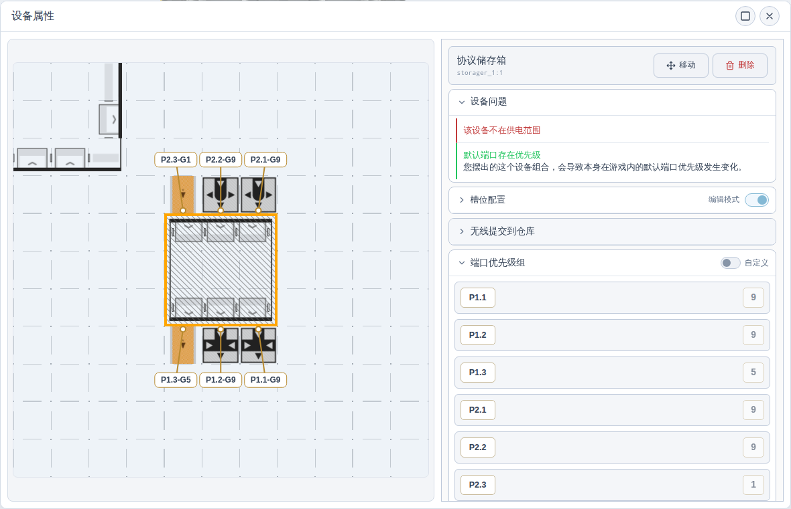

# 【浏览器里的集成工业】雪凇幽梦 功能更新1 v1.5.1

大家好！集成援助活动的蓝图研究好了吗?

在这一个月的时间里，我们一直在持续改进仿真运行速度，现在仿真的运行速度，比上个版本快20倍！惊人的效率！

那么节约出来的性能拿来干什么呢？当然是用来浪费啊。因此向大家隆重介绍全新功能：

## 播放设备动画与音效

现在选项中提供一个全新的选项：播放设备动画。
开启后，设备在运行时会正确的动起来，灯光和设备元件运动都有模拟。
这个功能大约会消耗2~4G显存，大量的CPU和GPU资源，以及还需要额外下载200M的动画包。
建议电脑性能溢出的富哥开启，从而提升沉浸感。

不过，传送带特效，和管道流动特效，现在默认开启。这个特效的消耗不高，并且观感提升巨大，因此默认锁定启用。

现在还可以开启“播放设备音效”，听到设备建造、拆除、属性和运行音效。声音会优先来自画面中心附近的设备，让你可以用自己的工厂来ASMR。

> 图：在“显示与性能”中分别开启设备动画与音效。

## 仿真与时间表现

- 我们新增了一个全新的仿真运行算法，可以加速仿真的运行。
- 为了以防万一，开启调试模式后，可以在调试分组中找到“使用旧版求解器（需刷新网页）”开关。该开关需要刷新浏览器生效。

## 默认端口优先级

游戏中，部分设备组合的默认端口优先级会受到连接方式和放置顺序影响，并不是所有端口都始终平等分配物流。

现在仿真会根据这些连接关系和放置顺序计算默认端口优先级，并在设备属性中显示；遇到会改变默认优先级的组合时，也会给出“默认端口存在优先级”的提示，方便排查物流分配与预期不一致的原因。

如果需要自行控制分配顺序，仍然可以启用自定义端口优先级。

> 图：左侧显示设备连接及各端口的优先级组，右侧显示默认优先级提示、具体数值和自定义开关。

## 实验性功能

- 新增自动蓝图规划，支持多轮继续计算并手动保存生成的蓝图，可在实验性功能中开启。

## 快捷键失灵

近期遇到多人反馈快捷失灵，如果你也遇到该问题，你可以试一下彻底关掉浏览器，然后重新打开浏览器后立即使用快捷键。
如果此时是好的，但是稍等一会坏了，这代表你遇到了最近Chrome内核的一个bug，请检查你的浏览器版本。
Chrome低于Chrome 153.0.8010.48，Edge低于153.0.4234.46的管理员请升级浏览器。

如果一打开浏览器立即使用本软件就不好使，请检查一下电脑里其他软件有没有占用快捷键。

上个版本，当工具箱停靠在页面下方时，会影响快捷键使用。现版本已经修复。

## 其他改动

- 统一产线规划、自动配方和配方选择器的默认配方顺序，和游戏内百科选择一致。
- 修复协议储存箱多槽位物流吞吐顺序，以及优先级组没有能正确生效的问题。
- 修复物流优先分流在设备顺序或线路长度变化时结果不稳定的问题；
- 修复布设传送带模式下，物流铺设预览经过交叉点继续延伸时，不能正确创建桥接器的问题。
- 修复蓝图预览和放置中的设备占地尺寸、旋转占地及设备标签显示，使预览范围与实际设备占地保持一致。
- 重组设置面板，分类更加清晰。
- 新增选区剪切与粘贴，并支持配置剪切快捷键。
- 优化蓝图连续放置、复制返回和物流放置提示等 UI 逻辑，使操作更接近游戏本体。
- 完善本地数据升级备份与恢复，防止旧标签页覆盖升级后的数据，并在本地读写失败时显示提示；回退恢复受备份有效期限制，恢复后不保留升级期间的编辑。
- 完善同步异常处理，对新版格式或损坏的远端数据给出明确提示，并支持使用本地数据覆盖或清理对应远端内容。
- 新增气体流动动画、管壁反射和物流交互特效，完善建筑动画与端口效果。
- 改善蓝图选中遮罩、放置虚影与落点指示。
- 更新草地背景、基地边界及基础区域放置判定。
- 修复设备属性面板中的仿真运行状态显示。
- 聚焦设备时使用 252% 缩放档位。
- 对管道准入口限速超过 60/分钟的配置增加提示。
- 首次开启设备动画时增加资源下载与性能消耗确认。
- 完善音效资源下载进度、失败重试和离线缓存。

## 💬 最后

如果遇到 bug 或者有什么想法，欢迎在评论区或者 GitHub Issues 提出来。
